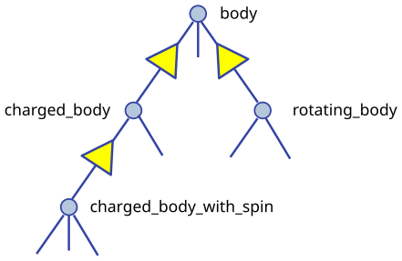

This article describes how advanced Fortran language features can be
applied toward object-based and object-oriented programming techniques.
These are, of course, to a significant extent a matter of taste,
personal style and possibly overarching program design considerations,
so should be taken with a pinch of salt.

Language features from Fortran 95 and later will be used; those from
Fortran 2003 and later will also be shortly described. They are
explained in more detail in e.g., Metcalf, Reid, Cohen and Bader.[^MFE]
See also [Fortran 95 language
features](https://en.wikipedia.org/wiki/Fortran_95_language_features) for
the language's fundamentals; the prerequisite for understanding this article
is that features explained there are well understood.

Boldface will be used where term definitions are introduced. They are
additionally annotated by "(not a Fortran term)" or similar if the term
is not used in the Fortran standard itself, but is in general use in the
technical literature.

Compilable and runnable example code is available from an external
[Github repository](https://github.com/reinh-bader/object_fortran).

# Object-based programming techniques  {#sec:oop_techniques}

# Introduction: Container-like types

The word "Container-like" is not a Fortran term, but used in the context
of this article to designate types with components whose size (or type,
to be discussed later) is not known when the type is declared. For
deferred sizing of array objects, this can be achieved by using either
the `POINTER` or the `ALLOCATABLE` attribute for the component's
specification.

The language features and programming techniques will be shown using two
examples introduced in the following section. The demonstration codes
for this chapter can be found in the `object_based` folder of the
[Github repository](https://github.com/reinh-bader/object_fortran).

# Examples for definitions of container-like types

## Allocatable components

As an example for the type definition of a **value container** (not a
Fortran term) with an `ALLOCATABLE` component consider

```f90
TYPE :: polynomial
   PRIVATE
   REAL, ALLOCATABLE :: a(:)
END TYPE
```

An object declared to be of this type

```f90
TYPE(polynomial) :: p
```

is suitable for characterization of a polynomial

$p(x) = \sum_{k=0}^{\text{degree}} a_{k} \cdot x^k \quad (x \in \Re)$

once it has been created and subsequently supplied with values of the
coefficients:

```f90
degree = ... ! integer value known at run time only
ALLOCATE( p%a(0:degree) )
p%a(0:) = ...
```

## Pointer components

As an example for the type definition of a **reference container** (not
a Fortran term) with a `POINTER` component consider

```f90
TYPE :: sorted_list
   PRIVATE
   TYPE(sortable) :: data
   TYPE(sorted_list), POINTER :: next => null()
END TYPE
```

Note that referencing the type itself when declaring a component is
permitted if that component has the `POINTER` or `ALLOCATABLE`
attribute; such types are generally known as **recursive**. They are
used to represent information structures (lists, trees, ...), often with
specific relationships between the individual data entries stored in
each node. In this example, the assumption is that entries of type
`data` in subsequent list items fulfill an ordering condition, based on
the functionality supplied with that type:

```f90
TYPE, PUBLIC :: sortable
   CHARACTER(len=:), ALLOCATABLE :: string
END TYPE

INTERFACE OPERATOR(<)          ! compare two objects of type sortable
   MODULE PROCEDURE less_than  ! implementation not shown here
END INTERFACE
```

<small>Given that Fortran supports arrays, use of simple linked lists is
in most cases inappropriate. The example is presented here as being the
simplest that permits illustrating the language features of
interest.</small>

An object declared to be

```f90
TYPE(sorted_list) :: my_list
```

is suitable as starting point for building a linked list with node
entries of type `data`. In the simplest case, inserting a data item into
the object is done by executing the following statements:

```f90
TYPE(sortable) :: my_data
:
my_data = ...
my_list%data = my_data  ! only compiles if type definition is accessible in host
```

However, as we shall see below, setting up a complete and valid
`sorted_list` object in a reliable manner needs additional work.

# Constructing objects of container-like type

The semantics of the default structure constructor for container-like
objects needs to account for any additional `POINTER` or `ALLOCATABLE`
attribute specified for type components.

For the first example type from the last section, the executable
statements in

```f90
TYPE(polynomial) :: q, r
:
q = polynomial( [2., 3., 1.] )
r = polynomial( null() )
```

result in an object `q` auto-allocated to the value
`q%a(1:3) == [2., 3., 1.]`, and an object `r` with `r%a` unallocated.

For the second example type from the last section, the executable
statements in

```f90
TYPE(sorted_list) :: sl1
TYPE(sorted_list), target :: sl2
TYPE(sortable) :: d1, d2
:
sl1 = sorted_list( data=d1, next=sl2 )  ! use keyword notation
sl2 = sorted_list( d2, null() )
```

result in an object `sl1` with `sl1%next` pointer associated with `sl2`,
and an object `sl2` with `sl2%next` disassociated; the `data` components
of both objects have values, `d1` and `d2`, respectively. Note that an
argument that matches with a `POINTER` component must have either the
`POINTER` or the `TARGET` attribute. Also, **keyword notation** can
be used in structure constructors in the same manner as for procedure
arguments.

The default constructor's behaviour has some properties that one needs
to be aware of:

1. If all type components have the `PRIVATE` attribute i.e., the type
   is **opaque** (not a Fortran term), it can only be used if the type
   declaration is accessed by host association (this is the same as for
   nonallocatable/nonpointer components);
2. especially for container-like types, its semantics may be
   incompatible with the programmers intentions for how the objects
   should be used.

Item 2 is illustrated by the above object setups, specifically:

- In the `polynomial` example given above, the lower bound of `q%a` is
  set to 1, contrary to the expectation that it should be 0. One could
  account for this by calculating index offsets in any module procedures
  that process `polynomial` objects, but this makes the code harder to
  understand and maintain. Also, the degree of the polynomial should be
  determined by the last nonzero entry of the coefficient array, but the
  language can of course not be aware of this.
- In the `sorted_list` example given above, the ordering requirement for
  entries in subsequent nodes is not checked, so will usually be not
  fulfilled. Also, if `sl2` goes out of scope before `sl1` does, the
  list structure is torn to bits.

The programmer can enforce appropriate semantics by overloading the
structure constructor. In this case, it is usually a good idea to
declare the types as being opaque.

Overloading the structure constructor is done by

- creating a named interface (i.e., a generic function) with the same
  name as the type of interest;
- creating at least one specific function (a subroutine is not
  permitted), usually returning a scalar result of the type of interest.

For the `polynomial` type the interface block (placed in the
specification section of the module containing the type definition)
might read

```f90
INTERFACE polynomial
! overload to assure correct lower bound when creating a polynomial object
   MODULE PROCEDURE :: create_polynomial
   ... ! further specifics as needed
END INTERFACE
```

and the implementation of `create_polynomial` (in the `CONTAINS` part of
the module) might read

```f90
PURE TYPE(polynomial) FUNCTION create_polynomial(a)
   REAL, INTENT(in) :: a(0:)
   INTEGER :: degree(1)

   degree = findloc( a /= 0.0, value=.true., back=.true. ) - 1
   ALLOCATE( create_polynomial%a(0:degree(1)) )
   create_polynomial%a(0:) = a(0:degree(1))
END FUNCTION
```

Because its signature matches the default structure constructor's, the
function actually overrides the default constructor, making it generally
unavailable.

For the `sorted_list` type the interface block might read

```f90
INTERFACE sorted_list
! the default constructor is unavailable because the type is opaque
! the specific has a different signature than the structure constructor
   MODULE PROCEDURE :: create_sorted_list
   ... ! further specifics as needed
END INTERFACE
```

with the implementation of `create_sorted_list` as follows:

```f90
PURE FUNCTION create_sorted_list(item_array) RESULT(head)
   TYPE(sortable), INTENT(in) :: item_array(:)
   TYPE(sorted_list) :: head
   INTEGER :: i

   DO i = 1, size(item_array)
      CALL add_to_sorted_list(head, item_array(i))
      ! handles tedious details of pointer fiddling
   END DO
END FUNCTION
```

The constructor has a signature that differs from that of the default
one, but the latter is unavailable outside the host scope of the type
definition anyway, due to the opacity of `sorted_list`.

# Copying objects of container-like type

Default assignment extends to container-like objects. For objects
declared as

```f90
TYPE(polynomial) :: p, q
TYPE(sorted_list) :: slp, slq

... ! code that defines p, slp
```

and after defining values for prospective right-hand sides, execution of
the statement

```f90
q = p
```

produces the same result as

```f90
IF ( allocated(q%a) ) DEALLOCATE( q%a )
q%a = p%a  ! performs auto-allocation using the RHS's bounds, then copies the value
```

and execution of the statement

```f90
slq = slp
```

produces the same result as

```f90
slq%data = slp%data
slq%next => slp%next  ! creates a reference between list objects without copying any value
```

The terms **deep copy** and **shallow copy** (neither are Fortran terms)
are sometimes used to describe the above behaviour for `ALLOCATABLE` and
`POINTER` components, respectively. Note that - different from the
default structure constructor - having `PRIVATE` components does not
affect the use of default assigment. However, the semantics of default
assignment might not be what is needed from the programmer's point of
view.

Specifically, consider the case where the object `slq` above has
previously been set up by invoking the overloaded constructor. The
assignment above would then have the following effects:

1. The list elements of the original `slq`, beginning with `slq%next`,
   would become inaccessible ("orphaned"), effectively causing a memory
   leak;
2. after the assignment statement, `slq%next` references into
   `slp%next`, resulting in aliasing.

To avoid 2., it is possible to [**overload** the assignment
operator](https://en.wikipedia.org/wiki/Fortran_95_language_features#Derived-data_types)
for reference containers to create a deep copy. Note that in the case
where defined unary or binary operations are introduced, the functions
that define these need to create deep copies to create the result
variable anyway, otherwise things simply don't work. The downside of
this is that in code like

```f90
slq = slp // slq
```

\ - with the overloaded concatenation operator meaning that the argument
lists are joined - multiple deep copies need to be done (the
implementation of the module procedure `join_lists` that supplies the
necessary specific for `//` is not shown here; see the source
`code sorted_list.f90` for details). It turns out that some of these
exist only intermediately.

Here an implementation of the specific procedure for the overloaded
assignment of `sorted_list` objects:

```f90
SUBROUTINE assign_sorted_list(to, from)
   TYPE(sorted_list), INTENT(in), TARGET :: from
   TYPE(sorted_list), INTENT(out), TARGET :: to  ! finalizer is executed on entry,
                                                 ! see below for discussion of this.
   TYPE(sorted_list), POINTER :: p, q

   p => from; q => to

   deep_copy : DO
      IF ( associated(p) ) THEN
         q%data = p%data
      ELSE
         EXIT deep_copy
      END IF
      p => p%next
      IF ( associated(p) ) ALLOCATE( q%next )
      q => q%next
   END DO deep_copy
END SUBROUTINE
```

Avoiding 1. is usually done by means of finalizers, to be discussed in
the next section. This is because assignment is not the only possible
cause for orphaning of `POINTER`-related memory (or indeed other
resource leaks).

# Finalization and conclusions

To deal with resource leaks that are otherwise not within the
programmer's means to avoid, a type definition can be connected with a
user-defined **final procedure** that is automatically invoked in
certain situations. For the `sorted_list` type, this would look like

```f90
TYPE :: sorted_list
   PRIVATE
   TYPE(sortable) :: data
   TYPE(sorted_list), POINTER :: next => null()
CONTAINS
   FINAL :: delete_sorted_list
END TYPE
```

Note that the `FINAL` statement appears after a `CONTAINS` statement in
the type definition; this implies that `delete_sorted_list` is not a
regular type component. The module procedure's implementation might then
be as follows:

```f90
PURE RECURSIVE SUBROUTINE delete_sorted_list(list)
   TYPE(sorted_list), INTENT(inout) :: list

   IF ( associated(list%next) ) THEN
      DEALLOCATE( list%next )  ! invokes the finalizer recursively
   END IF
END SUBROUTINE
```

It must be a subroutine that takes a single argument of the type to be
finalized. Most additional attributes are not permitted for that dummy
argument; for the case of finalizing array arguments it is possible to
have a set of finalizers (all listed in the type definition), each of
which declares the dummy argument with an appropriate rank.

<small>The `PURE` and `RECURSIVE` properties specified above reflect the
specific needs for the `sorted_list` type and its associated procedures.
The `RECURSIVE` specification is optional (i.e., procedures can be
called recursively by default), but a `NON_RECURSIVE` specification can
be supplied if the implementation's semantics does not permit correct
behaviour in recursive calls.</small>

The finalizer will be automatically invoked on an object if

1. it appears on the left-hand side of an intrinsic assignment
   statement (before the assignment is performed),
2. on invocation of a procedure call where it is argument associated
   with an `INTENT(out)` dummy,
3. it is a non-saved variable and program execution ends its scope, or
4. it is deallocated.

Nonpointer nonallocatable function results fall into the third category
above; however, finalization does not apply for the default structure
constructor.

Note that if a finalizer is defined and the constructor is overloaded,
but the assignment operator is *not*, then the assignment statement
`slq = sorted_list(...)` (which then translates into a single function
call to the `create_sorted_list()` function shown earlier) will result
in a mutilated left-hand side, because the finalizer will be executed on
the function that overloads the constructor, resulting in `slq%next`
being disassociated. For this reason, the following guideline applies:

> Recommendation: \
> Finalizers, overloads for the default constructor, and overload of the
> assignment operation should usually be jointly implemented.

See also the article "[Rule of
three](https://en.wikipedia.org/wiki/Rule_of_three_(C%2B%2B_programming))"
for the analogous situation in C++.

# Further language features useful for object-based programming

## Extended semantics for allocatable objects

Scalars can have the `ALLOCATABLE` attribute:

```f90
CHARACTER(len=:), ALLOCATABLE :: my_string
TYPE(sorted_list), ALLOCATABLE :: my_list
```

Allocation then can be done explicitly; the following examples
illustrate applications of the `ALLOCATE` statement that are useful or
even necessary in this context:

```f90
ALLOCATE( CHARACTER(len=13) :: my_string )                  ! typed allocation
ALLOCATE( my_list, source=sorted_list(array_of_sortable) )  ! sourced allocation
```

**Typed allocation** is necessary for the string variable, because the
length parameter of a string is part of its type; we will later see that
derived types can also appear in the type specification. **Sourced
allocation** permits the creation of an allocated object that is a clone
of the specified source object or expression.

Alternatively, allocatable objects (be they scalar or arrays) can be
auto-allocated by appearing on the left-hand side of an *intrinsic*
assignment statement:

```f90
my_string = "anything goes"  ! auto-allocated to RHS length before value is transferred
! my_list = sorted_list(array_of_sortable)
! the above statement would fail for an unallocated object, because the assignment
! has been overloaded using a nonallocatable first dummy argument
```

A caveat is that for *overloaded* assignment, this will usually not
work - either one needs to explicitly allocate the object before
assigning to it, or sourced allocation must be used, which bypasses the
overloaded assignment.

Note that for allocatable objects with deferred-size entries (e.g.,
strings, arrays) a non-conformable left-hand side in an assignment
statement will be deallocated before being allocated to the right length
or shape, respectively.

<small>The features discussed in this subsection are also useful for
object-oriented programming, with additional semantics applying for the
case of polymorphic objects.</small>

## Implementing move semantics

Sometimes it may be necessary to make use of move instead of copy
semantics i.e., create a copy of an object and then getting rid of the
original. The simplest way of doing this is to make use of allocatable
(scalar or array) objects,

```f90
TYPE(sorted_list), ALLOCATABLE :: my_list, your_list
```

After `your_list` has been set up, the object's content can then be
transferred to `my_list` by using the `move_alloc` intrinsic,

```f90
CALL move_alloc(your_list, my_list)
```

which will deallocate `my_list` if necessary, before doing the transfer.
After the invocation, `my_list` will have the value formerly stored in
`your_list`, and `your_list` will end up in the deallocated state. Note
that the latter does not involve a regular object deallocation
(effectively, a descriptor for the object is moved), so any existing
finalizer will not be invoked.

## The `BLOCK` construct

The above rules on finalization imply that variables declared in the
specification part of the main program are not finalizable, since they
by default have the `SAVE` attribute. One could argue this is not
necessary since all assigned memory is reclaimed when program execution
ends. However, excessive memory consumption or the use of other
resources may cause issues for reliable program execution. To work
around these, the `BLOCK` construct can be used:

```f90
PROGRAM test_sorted_list
   USE mod_sortable
   USE mod_sorted_list
   IMPLICIT none
   :
   work : BLOCK
      TYPE(sortable) :: array(items)
      TYPE(sorted_list) :: my_list, ...
      : ! initialize array

      my_list = sorted_list(array)
      :
   END BLOCK work  ! finalizer is executed on my_list, ...
   :
END PROGRAM
```

The construct (as the only one in Fortran) permits declaration of
non-saved variables in its specification part. Their lifetime ends when
program execution reaches the `END BLOCK` statement, and they therefore
are finalized at this point, if applicable. Named variables declared
outside the construct are accessible inside it, unless a block-local
declaration with the same name exists.

<small>Note that the construct's execution flow can be modified by
executing an `EXIT` statement in its body; this can, for example, be
used for structured error handling and finally permits sending `GO TO`
to retirement.</small>

## The `ASSOCIATE` construct

With the introduction of deeply nested derived types, code that needs
access to ultimate components can become quite hard to read. An
`ASSOCIATE` block construct that enables the use of auto-typed aliases
can be used. This is illustrated by a procedure that is used to
implement the multiplication of two polynomials:

```f90
PURE TYPE(polynomial) FUNCTION multiply_polynomial(p1, p2)
   TYPE(polynomial), INTENT(in) :: p1, p2
   INTEGER :: j, l, lmax

   lmax = ubound(p1%a,1) + ubound(p2%a,1)
   ALLOCATE( multiply_polynomial%a(0:lmax) )

   ASSOCIATE( a => p1%a, b => p2%a, c => multiply_polynomial%a, &
              jmax => ubound(p1%a,1), kmax => ubound(p2%a,1) )  ! association list
      DO l = 0, lmax
         c(l) = 0
         DO j = max(0, l-kmax), min(jmax, l)
            c(l) = c(l) + a(j) * b(l-j)
         END DO
      END DO
   END ASSOCIATE
END FUNCTION
```

For the duration of execution of the construct, the associate names can
be used to refer to their selectors (i.e., the right-hand sides in the
association list). If the selectors are variables, so are the associate
names (`a`, `b`, `c` in the above example), and can be assigned to. If
the selectors are expressions, so are the associate names (`jmax`,
`kmax` in the above example).

Associated entities that refer to variables inherit the `DIMENSION`,
`CODIMENSION`, `TARGET`, `ASYNCHRONOUS` and `VOLATILE` attributes from
their selectors, but no others. An associate name can only refer to an
`OPTIONAL` dummy argument if the latter is present. Associate names can
also appear in other block constructs (`SELECT TYPE`, `CHANGE TEAM`),
which will be discussed where appropriate.

# Performing I/O with objects of container-like type

For objects of container-like type, a data transfer statement

```f90
TYPE(sorted_list) :: my_list
: ! set up my_list
WRITE(*, *) my_list
```

would fail to compile, since the run-time library is incapable of
dealing with the irregular structures that are hiding behind the
innocuous variable. Language features for user-defined derived type I/O
(**UDDTIO**) permit the programmer to control the data transfer in an
appropriate manner. This is achieved by binding an I/O statement on a
derived-type object to a user-defined procedure, for example through a
suitably written named interface:

```f90
INTERFACE WRITE(formatted)
   MODULE PROCEDURE write_fmt_list
END INTERFACE
```

Note that this also applies to data types for which the above
stand-alone statement is permitted, and then overloads the default I/O
mechanism.

Once the binding is properly defined, the above I/O statement is
accepted by the compiler, and its execution causes the user-defined
procedure to be invoked. Therefore it is called the **parent** I/O
statement. The actual data transfer statements that are issued inside
the user-defined procedure are called **child** I/O statements.

The following interface variants are permitted, with the obvious
interpretation:

- `WRITE(formatted)`
- `READ(formatted)`
- `WRITE(unformatted)`
- `READ(unformatted)`

The self-defined procedure is restricted with respect to its interfaces'
characteristics, which are described in the following:

```f90
SUBROUTINE <formatted_io>   (dtv, unit, iotype, v_list, iostat, iomsg)
SUBROUTINE <unformatted_io> (dtv, unit,                 iostat, iomsg)
```

The placeholders `<formatted_io>` and `<unformatted_io>` must be replaced by
a specific procedure name referenced in the generic interface.

The dummy arguments' declarations and meaning are:

- `dtv`: Must be declared to be a nonpointer nonallocatable scalar
  of the type in question. If the type is extensible (to be explained
  later), the declaration must be polymorphic (i.e. using `CLASS`),
  otherwise non-polymorphic (using `TYPE`). Its `INTENT` must be `in`
  for `WRITE(...)`, and "`out`" or "`inout`" for `READ(...)`. It
  represents the object on which data transfer statements are to be
  executed.

  <small>Note: For the examples in this chapter, we need to
  use `CLASS`, but the behaviour is as if `TYPE` were used, as long as
  the actual arguments are non-polymorphic and the procedure-based
  interface is used for the invocation.</small>
- `unit`: An `INTEGER` scalar with `INTENT(in)`. Its value is that
  of the unit used for data transfer statements. Use of other unit
  values is not permitted (except, perhaps, `error_unit` for debugging
  purposes).
- `iotype`: A `CHARACTER(len=*)` string with `INTENT(in)`. This can
  only appear in procedures for formatted I/O. The following table
  describes how the incoming value relates to the parent I/O transfer
  statement:

| Value | Caused by parent I/O statement |
|----|----|
| `"LISTDIRECTED"` | `WRITE(unit, fmt=*) my_list` |
| `"NAMELIST"` | `WRITE(unit, nml=my_namelist)` **Note:** Referring to the example, at least one `sorted_list` object must be a member of `my_namelist`. |
| `"DTsorted_list_fmt"` | `WRITE(unit, fmt='(DT"sorted_list_fmt"(10,2))') my_list` **Note:** `DT` is the "derived type" edit descriptor that is needed in format-driven editing to trigger execution of the UDDTIO routine. The string following the `DT` edit descriptor can be freely chosen (even to be zero length); it is recommended that the UDDTIO procedure pay attention to any possible values supplied in the parent I/O statement if it supports DT editing. |

- `v_list`: A rank-1 assumed-shape `INTEGER` array with `INTENT(in)`
  . This can only appear in procedures for formatted I/O. The incoming
  value is taken from the final part of the `DT` edit descriptor; in the
  example from the table above it would have the value `[10,2]`. Free
  use can be made of the value for the disposition (formatting,
  controlling) of I/O transfer statements inside the procedure. The
  array's size may be zero; specifically, it will be of size zero for
  the listdirected or namelist cases.
- `iostat`: An `INTEGER` scalar with `INTENT(out)`. It must be given
  a value consistent with those produced by non-UDTTIO statements in
  case of an error. Successful execution of the I/O must result in a
  zero value. Unsuccessful execution must result in either a positive
  value, or one of the values `iostat_end` or `iostat_eor` from the
  `iso_fortran_env` intrinsic module.
- `iomsg`: A `CHARACTER(len=*)` string with `INTENT(inout)`. It must
  be given a value if a non-zero `iostat` is returned.

Additional properties and restrictions for UDDTIO are:

- All data transfers are executed in non-advancing mode. Any `advance=`
  specifier will be ignored;
- asynchronous I/O is not supported;
- Inside the user-defined routine, no file positioning statements are
  permitted.

The following demonstrates a partial implementation of formatted writing
on `sorted_list` objects:

```f90
RECURSIVE SUBROUTINE write_fmt_list(dtv, unit, iotype, v_list, iostat, iomsg)
   CLASS(sorted_list), INTENT(in) :: dtv
   INTEGER, INTENT(in) :: unit, v_list(:)
   CHARACTER(len=*), INTENT(in) :: iotype
   INTEGER, INTENT(out) :: iostat
   CHARACTER(len=*), INTENT(inout) :: iomsg
   CHARACTER(len=2) :: next_component

   IF ( associated(dtv%next) ) THEN
      WRITE(next_component, fmt='("T,")')
   ELSE
      WRITE(next_component, fmt='("F")')
   END IF
   SELECT CASE (iotype)
   CASE ('LISTDIRECTED')
      WRITE(unit, fmt=*, delim='quote', iostat=iostat, iomsg=iomsg) &
            dtv%data%string
   CASE ('NAMELIST')
      WRITE(unit, fmt=*, iostat=iostat, iomsg=iomsg) '"', &
            dtv%data%string, '",', trim(next_component)
   CASE default
      iostat = 129
      iomsg = 'iotype ' // trim(iotype) // ' not implemented'
      RETURN
   END SELECT
   IF ( associated(dtv%next) ) THEN
      CALL write_fmt_list(dtv%next, unit, iotype, v_list, iostat, iomsg)
   END IF
END SUBROUTINE
```

**Notes:**

- The namelist itself is inaccessible from the procedure; it is not
  needed since the procedure only needs to write the list values in a
  suitably formatted way. Termination of the list is indicated by a
  final logical value of `F` in the list entry of the namelist file; the
  termination information must be appropriately processed in the
  corresponding namelist case of the read procedure.
- The example implementation does not support `DT` editing; invoking the
  parent I/O statement from the above table would therefore cause error
  termination unless an `iostat=` argument is added to it.

# Object-oriented programming techniques

# Introduction: Establishing an explicit relationship between types

The discussion on object-based program design in the previous chapter
was based on creating derived types that are comprised of objects of
other types (intrinsic or derived); this is also known as **type**
**composition** (not a Fortran term). For object-oriented programming,
the approach is that a closer relationship between two (or maybe more)
types can be established through language-defined mechanisms, on both
the levels of type definition and object declaration and use. Fortran
supports a **single inheritance** model, which will be outlined in the
following sections; runnable example codes are supplied in the
`object_oriented` subfolder of the [Github
repository](https://github.com/reinh-bader/object_fortran)

# Extension types

As a starting point, consider the definition of a type, an object of
which can quite generally represent a physical body:

```f90
TYPE :: body
   REAL :: mass
   REAL :: pos(3), vel(3)
END TYPE
:
TYPE(body) :: my_basketball = body(1.5, [0.0, 0.0, 2.0], [10.0, 0.0, 0.0])
```

This might come along with procedures that impose a momentum change or a
change of mass on a `body` object:

```f90
PURE SUBROUTINE kick(a_body, dp)
   TYPE(body), INTENT(inout) :: a_body
   REAL, intent(in) :: dp(3)

   a_body%vel(:) = a_body%vel(:) + dp(:) / a_body%mass
END SUBROUTINE
PURE SUBROUTINE accrete(a_body, dm)
   TYPE(body), INTENT(inout) :: a_body
   REAL, intent(in) :: dm

   a_body%mass = a_body%mass + dm
END SUBROUTINE accrete
```

After writing lots of code that makes use of the above, imagine that you
now want to deal with objects that have the additional property of
electric charge. One could, of course, simply add another component to
the original `body` type, but in most cases this would invalidate
existing code which would need to be corrected, recompiled and retested.
Furthermore, all `body` objects would require the extra memory, which
for the existing codebase would simply be wasted. It is more convenient
and less intrusive to create a new type that is an **extension** of the
existing one (the **parent** type):

```f90
TYPE, EXTENDS(body) :: charged_body
   REAL :: charge
END TYPE
```

An object of this type

```f90
TYPE(charged_body) :: a_proton
```

would then have the following type components:

- `a_proton%mass`
- `a_proton%pos`
- `a_proton%vel`

that are **inherited** from the parent type, and the additional type
component

- `a_proton%charge`

that was added in the definition of `charged_body`. Furthermore, it is
also possible to reference that part of the object corresponding to the
parent type, which is a subobject of just that type:

- `a_proton%body`

Correspondingly, there are various manners in which the default
structure constructor can be used to create a defined value:

```f90
TYPE(body) :: a_mutilated_proton
! Construct a_proton
a_proton = charged_body(mass=1.672E-27, pos=[0.0, 0.0, 0.0], &
                        vel=[0.0 ,0.0, 0.0]), charge=1.602E-19)

! Alternative construction with the same result
a_mutilated_proton = body(mass=1.672E-27, pos=[0.0, 0.0, 0.0], &
                          vel=[0.0, 0.0, 0.0])

a_proton = charged_body(body=a_mutilated_proton, charge=1.602E-19)
```

Any derived type that does not have the `SEQUENCE` or `BIND(C)`
attributes can be extended in the above manner; specifically, an
extension type can itself be extended. For any given "base" type this
gives rise to a potential hierarchy of types that can be represented by
a directed acyclical graph:

{width=8cm}

An object of type `body` is **type compatible** with both `a_proton` and
`a_mutilated_proton`, so any of these two can, for example, appear in a
call to the procedure `kick`.

# Polymorphism

## Declaring entities with `CLASS`

By declaring an object with the `CLASS` instead of the `TYPE` specifier,
is is possible to defer the actual type that an object has to be
determined when the program executes, or even have the actual type
change during program execution. Such an object is designated as being
**polymorphic**. To be polymorphic, an object must fulfill one of the
following prerequisites:

- it has the `POINTER` attribute,
- it has the `ALLOCATABLE` attribute, or
- it is a dummy argument (with or without a `POINTER` or `ALLOCATABLE`
  attribute).

For example, the typed alllocation statement executed on a polymorphic
allocatable object

```f90
CLASS(body), ALLOCATABLE :: a_polymorphic_body
:
ALLOCATE( charged_body :: a_polymorphic_body )
```

causes the object `a_polymorphic_body` that has the **declared** type
`body` to be allocated with the **dynamic** type `charged_body`; in
Fortran nomenclature, the latter term denotes what was referred to above
as "actual" type.

<small>For an unallocated allocatable or a disassociated pointer the
dynamic type is considered to be the same as the declared type, although
this is only useful in very few contexts that do not require the object
to be allocated or associated.</small>

## Run-time type and class identification

Within the scope of the object's declaration, only the components of its
declared type are accessible. Also, I/O operations on a polymorphic
object are not permitted, unless UDDTIO routines have been defined. One
way to obtain access to the complete object is to use a construct that
permits **run-time type identification** (not a Fortran term),
`SELECT TYPE`. For example, the I/O statements in

```f90
SELECT TYPE (a_polymorphic_body)
TYPE IS (body)
   WRITE(*,*) 'object of type body has value        ', a_polymorphic_body
TYPE IS (charged_body)
   WRITE(*,*) 'object of type charged_body has value', a_polymorphic_body
CLASS default
   ERROR STOP 'Type extension unsupported in this construct'
END SELECT
```

are permitted, since inside the block for each **type guard** the object
is non-polymorphic and of the specified type. At most one type guard can
match the object's type, and the corresponding statements are executed;
otherwise the `CLASS default` section is executed (and the object
remains polymorphic there). A disadvantage of using `SELECT TYPE` is
that it needs to be appropriately updated whenever an additional type
extension is defined; apart from the maintenance effort this also
requires access to all source code that contain a relevant instance of
the construct. For this reason, type-bound procedures (to be discussed)
should be preferably used to gain access to additional type components.

For updates of the `charge` component of a `charged_body` object, one
now could consider the following:

```f90
SUBROUTINE recharge(a_charged_body, dq)
   TYPE(charged_body), INTENT(inout) :: a_charged_body
   REAL, INTENT(in) :: dq

   a_charged_body%charge = a_charged_body%charge + dq
END SUBROUTINE
```

However, invoking this subroutine in the usual Fortran 95 style will not
work for the variable `a_polymorphic_body`, since it violates the rule
that the dummy argument's declared type must be type compatible with the
actual argument's declared type. One can work around this by using a
`SELECT TYPE` construct with **run-time class identification** (not a
Fortran term), based on writing **class guards** instead of type guards:

```f90
SELECT TYPE (a_polymorphic_body)
CLASS IS (charged_body)  ! new declared type for a_polymorphic_body
   CALL recharge(a_polymorphic_body, dq=1.0e-5)
CLASS default
   WRITE(*,*) 'INFO: object a_polymorphic_body was not modified.'
END SELECT
```

The `recharge` procedure will then be invoked if the dynamic type of
`a_polymorphic_body` is `charged_body` or an extension of it. The object
remains polymorphic inside the class guard, only its declared type
changes to that specified in the guard. Unless the "lifted" declared
type of interest is already otherwise known from the context, or
handling the `CLASS default` fall-through is straightforward, this is
not in general a desirable way of dealing with class mismatches.

<small>It is permitted to mix type and class guards in a `SELECT TYPE`
construct; in that case, a type guard has precedence over a class guard
specifying the same type with respect to selection of the guarded
statements to be executed.</small>

## Unlimited polymorphic objects

A special case of polymorphism is that an object can be **unlimited
polymorphic**. Such an object, declared with `CLASS(*)`, can be of any
dynamic type (intrinsic type, extensible derived type, `SEQUENCE` or
`BIND(C)` derived type), as illustrated by the following statements:

```f90
CLASS(*), ALLOCATABLE :: a_unlimited  ! has no declared type, so any type is an extension

ALLOCATE( a_unlimited, source=2.5E4)  ! dynamic type becomes real

SELECT TYPE ( a_unlimited )
TYPE IS (REAL)
   WRITE(*,*) 'a_unlimited is of intrinsic real type with value ', a_unlimited
END SELECT

DEALLOCATE( a_unlimited )
ALLOCATE( a_unlimited, source=a_proton) )  ! dynamic type becomes charged_body

SELECT TYPE ( a_unlimited )
TYPE IS (charged_body)
   WRITE(*,*) 'a_unlimited is a charged_body with value ', a_unlimited
END SELECT
```

Accessing the object's data *always* needs a `SELECT TYPE` construct;
type guards in the construct can in this case might not only refer to
extensible types, but also to intrinsic types. However, for `SEQUENCE`
or `BIND(C)` derived types, no type resolution is possible - these
always fall through to a `CLASS default` guard, if present; use of
unlimited polymorphic objects to store values of such types is therefore
considered unsafe.

In this context, allocation with `source=` allocates the target object
to the source object's dynamic type before copying its value to the
target object. If the source object's data is not needed, `mold=` can be
used instead. Sourced allocation becomes a powerful tool, since the
dynamic type of the source object need not be known in the scoping unit
within which the allocation is executed.

Type components with the `POINTER` or `ALLOCATABLE` attribute can be
unlimited polymorphic, enabling the construction of generic and
potentially inhomogeneous container-like types. As an illustration of
this, a supporting type for the purpose of holding data targeted for
manipulation of other objects is presented; its definition (placed in
the module `mod_utility_types`) reads

```f90
TYPE :: any_object
   CHARACTER(len=:), ALLOCATABLE :: description
   CLASS(*), ALLOCATABLE :: value(:)
   INTEGER, ALLOCATABLE :: shape(:)
END TYPE
```

where `description` will refer to the property that needs updating, and
`value` will contain the data to be used for the transaction. Because
the `value` component should be able to represent any type, it is
declared as being unlimited polymorphic. Because the `value` component
might hold data needed to produce an array of arbitrary shape, the
additional `shape` component is supplied, but its use is really only
necessary if objects of rank at least 2 must be dealt with. The
structure constructor for that type has been overloaded to work around
compiler bugs and make handling of scalar data easier. The following
example illustrates how to establish a simple interface for setting
components of a structure:

```f90
MODULE mod_wtype
   USE mod_utility_types, ONLY : initialize => any_object

   TYPE :: wtype
      PRIVATE
      INTEGER :: nonzeros = -1
      REAL, ALLOCATABLE :: w(:,:)
   END TYPE wtype
CONTAINS
   SUBROUTINE setup_wtype(a_wtype, a_component)
      ! in-place setting to avoid memory bursts for large objects
      TYPE(wtype), INTENT(inout) :: a_wtype
      TYPE(initialize), INTENT(in), TARGET :: a_component
      INTEGER :: wsize
      REAL, POINTER :: pw(:,:)

      SELECT CASE (a_component%description)
      CASE ("nonzeros")
         IF ( allocated(a_component%value) ) THEN
            SELECT TYPE ( nonzeros => a_component%value(1) )
            TYPE IS (INTEGER)
               a_wtype%nonzeros = nonzeros
            END SELECT
         END IF
      CASE ("w")
         IF ( allocated(a_component%value) .AND. allocated(a_component%shape) ) THEN
            wsize = size(a_component%value)
            IF ( wsize >= product(a_component%shape) ) THEN
               SELECT TYPE ( w => a_component%value )
               TYPE IS (REAL)
                  pw(1:a_component%shape(1), 1:a_component%shape(2)) => w
                  a_wtype%w = pw
               END SELECT
            END IF
         END IF
      END SELECT
   END SUBROUTINE setup_wtype
   :
END MODULE
```

**Notes:**

- Having this simple interface at the cost of significant additional
  setup code might at first sight appear frivolous; however, once type
  extension is used on a larger scale, setting or modifying further
  components in the conventional way becomes rather irksome without a
  concept like that above, especially if
  [type-bound procedures](#sec:tbp)
  with a simple *and* uniform interface must be implemented;
- The object `a_wtype` remains unchanged in case an unsuitable value is
  provided for `a_component`. One could add explicit error handling, but
  for these examples this is considered an unnecessary complication;
- The permitted values for the `initialize` object should be documented
  for each procedure that takes such an object;
- Because access to `a_component` within `SELECT TYPE` is via a type
  component, one is obliged to introduce an associate name for the
  latter. The language rules only permit omitting the associate name for
  named variables, and subobjects are not named variables;
- A **rank-changing pointer assignment** is used to transform the rank-1
  `a_component%value` array to an object that can be assigned to a
  rank-2 `a_wtype%w` array; this works because the right-hand side is a
  rank-1 object; for rank-2 and higher the rank-changing pointer
  assignment will only work if the target assigned to is a **simply
  contiguous array designator** (a topic not covered here). Note that in
  this context, the `reshape` intrinsic cannot be used because it
  requires the size of its `shape` argument to be a constant.

The program invoking the `setup_wtype` procedure might do so as follows,
to set up a `wtype` object:

```f90
USE mod_wtype
TYPE(initialize) :: c_nz, c_w
TYPE(wtype) :: my_wtype
INTEGER :: i, j
INTEGER :: ndim

ndim = ...

ASSOCIATE ( my_data => [ ((real (max(0, min(i-j+2, j-i+2))), j=1, ndim), i=1, ndim) ] )
   c_nz = initialize("nonzeros", count(my_data /= 0))
   c_w = initialize("w", my_data, [ ndim, ndim ] )
END ASSOCIATE

CALL setup_wtype(my_wtype, c_nz)
CALL setup_wtype(my_wtype, c_w)
```

# Type-bound procedures (TBP)  {#sec:tbp}

To resolve the class mismatch issues arising from the use of polymorphic
objects, one needs a language mechanism for making a run-time decision
on a procedure invocation that depends on the dynamic type of a
polymorphic object. This can be achieved by binding a procedure to a
type in the type definition via a `PROCEDURE` statement in the type's
`CONTAINS` part.

For the type `body`, the augmented type definition reads

```f90
TYPE :: body
   REAL :: mass
   REAL :: pos(3), vel(3)
CONTAINS
   PROCEDURE :: update => update_body
END TYPE
```

This does not impact how the structure constructor is used; for this,
only the specifications before the `CONTAINS` statement are relevant. To
establish a simple and uniform interface for object updates, the
procedure `update_body` makes use of the `any_object` type discussed
earlier, which in view of the context is locally renamed to `change`:

```f90
SUBROUTINE update_body(a_body, a_change)
   CLASS(body), INTENT(inout) :: a_body
   TYPE(change), INTENT(in) :: a_change
   IF ( allocated(a_change%description) .AND. allocated(a_change%value) ) THEN
     SELECT CASE ( trim(a_change%description) )
     CASE ('mass')
        SELECT TYPE ( delta => a_change%value(1) )
        TYPE IS (real)
           CALL accrete(a_body, delta)
        END SELECT
     CASE ('momentum')
        SELECT TYPE ( delta => a_change%value )
        TYPE IS (real)
           IF ( size(delta) >= 3 ) CALL kick(a_body, delta(1:3))
        END SELECT
     CASE ('position')
        SELECT TYPE ( delta => a_change%value )
        TYPE IS (real)
           IF ( size(delta) >= 3) a_body%pos = a_body%pos + delta(1:3)
        END SELECT
     END SELECT
   END IF
END SUBROUTINE
```

In its interface, the **passed object** `a_body` must be declared to be
a polymorphic scalar, with its declared type being the one the procedure
has been bound to. The implementation reuses existing code where
possible (very simple in this example, but this is of course not
generally the case), to avoid the need for extensive revalidation.

Invocation of the procedure could be done in the usual manner, but the
preferred style, especially in the case that the actual argument is
polymorphic, is to do it through the object itself:

```f90
TYPE(change) ::  dx
:
dx = change(description='mass', value=[0.0, 2.0, 0.0])

CALL my_basketball%update(dx) ! invokes update_body(my_basketball, dx)
```

For polymorphic objects, the procedure `update_body` will be invoked if
the dynamic type of the object is `body` (this might not be true if the
dynamic type is an extension, as we shall see).

<small>The invocation can also be done with non-polymorphic objects; in
this case, the binding could (in principle) be determined at compilation
time, potentially saving some call overhead. Note that the passed object
dummy is not permitted to be allocatable or a pointer, which facilitates
this usage.</small>

So far this is not particularly interesting; the key thing is what
happens once we turn to type extensions. For example, to enable
modification of the `charge` component (in addition to that of other
components) of an object of dynamic type `charged_body`, it is possible
to **override** the parent type's bound procedure:

```f90
TYPE, EXTENDS(body) :: charged_body
   REAL :: charge
CONTAINS
   PROCEDURE :: update => update_charged_body
END TYPE
```

with the procedure defined as follows:

```f90
SUBROUTINE update_charged_body(a_body, a_change)
   CLASS(charged_body) :: a_body
   TYPE(change) :: a_change

   IF ( allocated(a_change%description) .AND. allocated(a_change%value) ) THEN
      SELECT CASE ( trim(a_change%description) )
      CASE ('charge')
         SELECT TYPE ( delta => a_change%value(1) )
         TYPE IS (real)
            a_body%charge = a_body%charge + delta
         END SELECT
      CASE default
         CALL a_body%body%update(a_change)
         ! assure that a change to a parent component is dealt with
      END SELECT
   END IF
END SUBROUTINE
```

The overriding procedure must use the same interface as the overridden
procedure, except that the passed object is declared to be of the
extended type; even the argument keywords must be the same. Once the
override has been defined, the call through an object of dynamic type
`charged_body` will be dispatched to `update_charged_body`:

```f90
TYPE(change) ::  dc, dp
CLASS(body), ALLOCATABLE :: my_polymorphic_body

my_polymorphic_body = charged_body(mass=1.5, pos=[0.,0.,0.], &
                                   vel=[2.,0.,0.], charge=2.41E-5)
!  the above statement auto-allocates the left hand side
dc = change(description='charge', value=5.0E-6)
dp = change(description='momentum', value=[-1.0,1.0,0.0])

! both the following dispatch to update_charged_body
CALL my_polymorphic_body%update(dc)
CALL my_polymorphic_body%update(dp)
```

**Notes:**

- for the above example, direct invocation of the procedure
  `update_charged_body` is not possible (as already noted earlier);
- the second TBP call illustrates the invocation of the parent object
  update from `update_charged_body`. Without this, changes that impact
  the parent object would not be done. By implementing this consistency
  of behaviour, the programmer assures that the inheritance hierarchy
  adheres to the [Liskov substitution
  principle](https://en.wikipedia.org/wiki/Liskov_substitution_principle);
- to enforce using the TBP calls in a use association context, the
  module procedures that implement them can be made `PRIVATE`. The
  accessibility of the TBP itself is determined by the attribute for it
  (default is `PUBLIC`) in the type definition;
- the programmer can prevent overriding of a binding by declaring it to
  be `NON_OVERRIDABLE`; its implementation then is regarded as valid for
  all conceivable extension types.

# Abstract types and interfaces

The `sortable` type used for demonstrating the `sortable_list`
functionality in the
[object-based chapter's](#sec:oop_techniques)
example was set up as a fixed container-like type. It is desirable to be
able to use the list machinery more flexibly i.e., for any type that
supports the "less-than" comparison. This can be achieved by introducing
an **abstract type**

```f90
TYPE, ABSTRACT :: sortable
CONTAINS
   PROCEDURE(compare), DEFERRED :: less_than
   ! ... more to follow
END TYPE
```

with a **deferred binding**. It is not possible to create an object
whose dynamic type is abstract, or a non-polymorphic object of abstract
type. For this reason, the deferred binding cannot represent an existing
procedure, but is characterized by an **abstract interface**:

```f90
ABSTRACT INTERFACE
   PURE LOGICAL FUNCTION compare(s1, s2)
      IMPORT :: sortable
      CLASS(sortable), INTENT(in) :: s1, s2
      ! dispatch is via the first argument
   END FUNCTION
END INTERFACE
```

The `IMPORT` statement is required to give the interface access to the
type defined in its host. Furthermore, an override of the structure
constructor will be needed

```f90
INTERFACE sortable
   PROCEDURE :: create_sortable
END INTERFACE
```

that permits creation of polymorphic `sortable` objects. The details of
this will be described later (since, indeed, a devil lurks in these
details). Note that the above combined use of abstract types and
interfaces is also known under the (non-Fortran) term **interface
class**.

This framework permits the programmer to implement the following
programming technique, which is also known as **dependency inversion**
(not a Fortran term):

1. Any machinery that makes use of polymorphic `sortable` objects is
   made to only refer to the above abstractions. For example, the
   definition of the `sorted_list` type could be adapted to read

   ```f90
   TYPE, PUBLIC :: sorted_list
      PRIVATE
      CLASS(sortable), ALLOCATABLE :: data
      ! changed to refer to abstract type
      TYPE(sorted_list), POINTER :: next => null()
   CONTAINS
      FINAL :: delete_sorted_list
   END TYPE
   ```

The advantage of this is that no change to the preexisting machinery
will be needed whenever a programmer decides to add an extension type
as outlined in 2. below.

2. For a concrete realization of a `sortable` object, the programmer
   needs to create a type extension, for example

   ```f90
   TYPE, PUBLIC, EXTENDS(sortable) :: sortable_string
      CHARACTER(len=:), ALLOCATABLE :: string
   CONTAINS
      PROCEDURE :: less_than => less_than_string
   END TYPE
   ```

including an *obligatory* implementation `less_than_string` of an
overriding TBP for the deferred binding. The constructor function
(promised earlier, but not yet delivered) also needs to be updated to
enable creation of objects of the extended type.

# Generic type-bound procedures and operator overloading

As a convenience, use of an overloading for the comparison operator "\<"
can be provided by creating a **generic** type-bound procedure:

```f90
TYPE, ABSTRACT :: sortable
CONTAINS
   PROCEDURE(compare), DEFERRED :: less_than
   GENERIC :: OPERATOR(<) => less_than
END TYPE
```

which means that when a statement involving a comparison expression

```f90
CLASS(sortable), ALLOCATABLE :: s1, s2

s1 = sortable( ... )
s2 = sortable( ... )

IF ( s1 < s2 ) THEN
   ...
END IF
```

is executed, the overridden type-bound procedure bound to the first
operand will be invoked to evaluate the expression. It is not necessary
to re-specify the `GENERIC` clause in any type extensions; the dispatch
will automatically select the overridden procedure.

Named generic type-bound procedures that do not overload existing
operations can also be defined; an example for this is given in the
section
"[Functions with parameters](#sec:functions_with_parameters)".
The rules for generic resolution work similar as for nonpolymorphic
generic procedure interfaces, with the additional restriction that
polymorphic dummy arguments that are related by inheritance cannot be
distinguished for the purpose of compile-time resolution to a specific
procedure.

# Completing the dependency inversion

## Discussion of structural dependencies

When implementing the above concept, typically a separate module, say
`mod_sortable_extensions`, is created for some or all of the extension
types of `sortable`. The motivations for this can be:

- avoid recompilation of any machinery that makes use of the
  `mod_sortable` module;
- the source code of `mod_sortable` might not be readily modifiable;
- prevent `mod_sortable` from turning into a monster module in case
  large concepts are implemented through extension types, or many
  extension types are created.

The implementation of the constructor will need to use associate
`mod_sortable_extensions` since it needs to be able to create objects of
the types defined there. On the other hand, the interface to the
constructor needs to be visible in `mod_sortable`, since the machinery
that depends on it must be able to call it. As a consequence, one would
end up with a circular `USE` dependency between the two modules, which
is prohibited.

## Using submodules to break dependency cycles

To deal with such a situation (among others), the concept of
**submodule** is available. This is a type of program unit that serves
as an extension to an existing module (or submodule), to which it has
access by host association. Furthermore, submodules allow the programmer
to separate interfaces from implementations; the former are defined in
the parent program unit (i.e., the program unit of which the submodule
is an extension), the latter in the submodule itself.

For the constructor function, the following interface block can be
declared in `mod_sortable`:

```f90
INTERFACE
   MODULE FUNCTION create_sortable(init) RESULT(r)
      CLASS(sortable), ALLOCATABLE :: r
      TYPE(initialize), INTENT(in) :: init
   END FUNCTION
END INTERFACE
```

The special notation `MODULE FUNCTION` (or `MODULE SUBROUTINE` for a
subroutine) tells the compiler that the implementation is deferred to a
submodule.

**Notes:**

- the above interface requires no reference to any entities contained in
  `mod_sortable_extensions`;
- consistent with this, the variable representing the function result is
  an allocatable polymorphic object of the abstract type;
- an `IMPORT` statement is not obligatory in separate module procedure
  interfaces, although it is permitted (compiler support assumed!),
  primarily for the purpose of fine-grain control of host access;
- the type `initialize` is, again, a renamed version of the `any_object`
  type referred to earlier.

## Implementation of the constructor

The submodule containing the implementation then reads as follows:

```f90
SUBMODULE (mod_sortable) smod_constructor
CONTAINS
   MODULE PROCEDURE create_sortable
      USE mod_sortable_extensions, ONLY : sortable_string

      IF ( allocated(init%description) .AND. allocated(init%value) ) THEN
         SELECT CASE (init%description)
         CASE ('sortable_string')
            SELECT TYPE ( value => init%value(1) )
            TYPE IS (CHARACTER(len=*))
               ALLOCATE( r, source=sortable_string(value) )
            END SELECT
         END SELECT
      END IF
   END PROCEDURE
END SUBMODULE
```

**Notes:**

- The interface for the separate module procedures is omitted, since it
  can be deduced from its specification in the parent module. However,
  alternative syntax exists that replicates the interface (but this is
  not shown here);
- the effect of the `ONLY` clause is to suppress use access to any
  entity of the parent program unit (which would be indirectly
  established). This is because use association overrides host
  association, which may cause undesirable side effects;
- submodules additionally can contain specifications (before the
  `CONTAINS` statement), as well as local submodule procedures. All
  these are only accessible from the submodule (and its descendant
  submodules, if any);
- the naming scheme for a submodule always references the direct parent.
  For submodules of submodules, the scheme is
  `SUBMODULE (<parent module>:<parent submodule>) <submodule_name>`
  and the names of submodules of a given module must be unique.

## Diagramming the dependencies between program units

The following diagram shows the use and host association relationships
between the modules (blue boxes), the submodule (green box), and a main
program unit (orange box) for this example:

{width=8cm}

The small triangles in the diagram refer to use ("u") association and
host ("h") association, respectively. The separation of the
constructor's interface from its implementation leads to avoidance of
circular `USE` references (the lower two "u" triangles in the diagram).

The compilation order for separate files would be:

1. `mod_sortable`
2. `program` and `mod_sortable_extensions`, independently
3. `smod_constructor`

# Performance and ease of use

# Functions with parameters  {#sec:functions_with_parameters}

## A type definition for invocation of a general function

In scientific applications, a commonly occurring requirement is the need
to evaluate functions that depend on additional parameters, apart from
their real-valued argument. For example, an application might need the
value of spherical Bessel function $x \mapsto j_l(q \, x)$ for
independently specified integer values of $l$ and real values of $q$.
More generally, one can consider a real-valued mapping

$\Re \ni x \mapsto f_\lambda(x) \quad (\lambda \in \Omega)$,

where the parameter value $\lambda$ can be from some arbitrary set. This
section presents a way for handling this programmatically, using the
object-oriented features of Fortran. We start with the outline for a
type definition of sufficient generality:

```f90
TYPE, PUBLIC :: pfunc_type
   PRIVATE
   PROCEDURE(pfunc), POINTER, NOPASS :: fp => null()
   : ! shown later
   CLASS(*), ALLOCATABLE :: param
CONTAINS
   : ! shown later
END type pfunc_type

ABSTRACT INTERFACE
   PURE REAL FUNCTION pfunc(x, param)
      REAL, INTENT(in) :: x
      CLASS(*), INTENT(in), OPTIONAL :: param
   END FUNCTION pfunc
END INTERFACE
```

It supplies

- a **procedure pointer** component with an abstract interface that
  reflects the above mapping;
- an unlimited polymorphic parameter component, to keep all things in
  one place.

Notionally, one could invoke a properly set up `pfunc_type` object
through

```f90
TYPE(pfunc_type) :: pfunc_obj
REAL :: x

pfunc_obj = pfunc_type(psin, 2)
! definitions of procedure and data object discussed further below
x = ...

WRITE(*,*) 'Function value is ', pfunc_obj%fp(x, pfunc_obj%param)
```

Use of a procedure pointer reflects the fact that each `pfunc_type`
object will want to associate its individual target function; this is
sometimes also referred to as an **object-bound procedure**. The
`NOPASS` attribute in the type definition is needed because otherwise
(analogous to what we saw for the earlier type-bound procedure
examples), the object through which the invocation is done would be
obliged to appear as a first argument in the abstract interface `pfunc`;
this would constitute an additional imposition on the implementation of
the supplied functions. On the other hand, the invocation needs to
explicitly specify the `param` component, making it a bit unwieldy; the
use of `pfunc_type` objects will be simplified as we go on.

## Performance issues arising from object-oriented programming

Let us look at a target function implementation, in form of a trivial
example $\sin(\lambda x)$:

```f90
PURE REAL FUNCTION psin(x, param)
   REAL, INTENT(in) :: x
   CLASS(*), INTENT(in), OPTIONAL :: param
   REAL :: factor
   factor = 1.
   IF ( present(param) ) THEN
      SELECT TYPE ( param )
      TYPE IS (REAL)
         factor = param
      TYPE IS (INTEGER)
         factor = real(param)
      END SELECT
   END IF
   psin = sin(factor*x)
END FUNCTION psin
```

Given that an application is likely to request a large number of
function values, the following effects would ensue once for each
invocation:

- function call overhead, and
- overhead of run-time type resolution.

The resulting performance impact is typical for object-oriented designs
that operate in multitudes on small objects. Making use of an
array-based version of the function

```f90
PURE FUNCTION psin_array(x, param) RESULT(r)
   REAL, INTENT(in) :: x(:)
   REAL :: r(size(x))
   CLASS(*), INTENT(in), OPTIONAL :: param
   REAL :: factor
   factor = 1.
   IF ( present(param) ) THEN
      SELECT TYPE ( param )
      TYPE IS (REAL)
         factor = param
      TYPE IS (INTEGER)
         factor = real(param)
      END SELECT
   END IF
   r = sin(factor*x)  ! kernel
END FUNCTION psin_array
```

is desirable, since the overheads specified above only arise *once*, and
the actual calculational code (marked "kernel" in the above box) is
amenable to array-related compiler optimizations (the specifics of which
depend on both hardware architecture and working set size).

## Completing the function type definition

The aim now is to proceed to a framework that permits to use both the
scalar and the array versions in a uniform way, thereby making life for
the clients that use the framework easy, while enabling performance
where it is needed.

The full definition of `pfunc_type`, including its referenced abstract
interfaces, reads

```f90
TYPE, PUBLIC :: pfunc_type
   PRIVATE
   PROCEDURE(pfunc), POINTER, NOPASS :: fp => null()
   PROCEDURE(pfunc_array), POINTER, NOPASS :: fp_array => null()
   CLASS(*), ALLOCATABLE :: param
CONTAINS
   PROCEDURE, PASS, PRIVATE, NON_OVERRIDABLE :: f_scalar, f_array
   GENERIC :: f => f_scalar, f_array
END type pfunc_type

ABSTRACT INTERFACE
   PURE REAL FUNCTION pfunc(x, param)
      REAL, INTENT(in) :: x
      CLASS(*), INTENT(in), OPTIONAL :: param
   END FUNCTION pfunc
   PURE FUNCTION pfunc_array(x, param) RESULT(r)
      REAL, INTENT(in) :: x(:)
      REAL :: r(size(x))
      CLASS(*), INTENT(in), OPTIONAL :: param
   END FUNCTION pfunc_array
END INTERFACE
```

Because we now have two procedure pointers in the type (only one of
which is used in each given object), it is advantageous to provide a
generic type-bound procedure `f` as a front end for ease of use. The
specifics `f_scalar` and `f_array` for this read

```f90
REAL FUNCTION f_scalar(this, x)
   CLASS(pfunc_type), INTENT(in) :: this
   REAL, INTENT(in) :: x

   IF ( associated(this%fp) ) THEN
      f_scalar = this%fp(x, this%param)
   ELSE IF ( associated(this%fp_array) ) THEN
      ASSOCIATE ( f_array => this%fp_array([x], this%param) )
         f_scalar = f_array(1)
      END ASSOCIATE
   ELSE
      ERROR STOP 'pfunc_type callback: uninitialized object'
   END IF
END FUNCTION f_scalar
FUNCTION f_array(this, x) RESULT(r)
   CLASS(pfunc_type), INTENT(in) :: this
   REAL, INTENT(in) :: x(:)
   REAL :: r(size(x))

   ! Note that support for the scalar version is omitted here, since
   ! the procedure call overhead, including type resolution, would
   ! significantly impact performance.
   IF ( associated(this%fp_array) ) THEN
      r = this%fp_array(x, this%param)
   ELSE
      ERROR STOP 'pfunc_type callback: uninitialized object'
   END IF
END FUNCTION f_array
```

The only way to invoke one of these (in a use association context) is
via the generic name, since the specific type-bound procedures have the
`PRIVATE` attribute; note that `pfunc_type` is not designed for being
extended. Disambiguation is by rank of `x`.

The structure constructor for the type is overloaded

```f90
INTERFACE pfunc_type
   MODULE PROCEDURE create_pfunc_type
   MODULE PROCEDURE create_pfunc_type_array
END INTERFACE pfunc_type
```

with the following specific functions:

```f90
TYPE(pfunc_type) FUNCTION create_pfunc_type(fp, param)
   PROCEDURE(pfunc) :: fp
   CLASS(*), INTENT(in), OPTIONAL :: param
   create_pfunc_type%fp => fp
   IF ( present(param) ) THEN
      ALLOCATE(create_pfunc_type%param, source=param)
   END IF
END FUNCTION create_pfunc_type
TYPE(pfunc_type) FUNCTION create_pfunc_type_array(fp_array, param)
   PROCEDURE(pfunc_array) :: fp_array
   CLASS(*), INTENT(in), OPTIONAL :: param
   create_pfunc_type_array%fp_array => fp_array
   IF ( present(param) ) THEN
      ALLOCATE(create_pfunc_type_array%param, source=param)
   END IF
END FUNCTION create_pfunc_type_array
```

Disambiguation is possible due to the sufficiently different interfaces
of the procedure arguments.

## Using the function type

With the already-shown implementations for the target functions `psin`
and `psin_array`, using this framework is illustrated by the following:

```f90
TYPE(pfunc_type) :: pfunc_obj
REAL, PARAMETER :: piby4 = atan(1.0), &
   piby4_arr(4) = [ piby4, 2.*piby4, 3.*piby4, 4.*piby4 ]

pfunc_obj = pfunc_type(psin, 2.)
WRITE(*,*) pfunc_obj%f(piby4)

pfunc_obj = pfunc_type(psin)
WRITE(*,*) pfunc_obj%f(piby4)

pfunc_obj = pfunc_type(psin_array, 2.)
WRITE(*,*) pfunc_obj%f(piby4_arr)
```

Omitting a `param` in a constructor is fine, as long as the target
functions cater for the dummy argument's non-presence.

<small>The framework's implementation makes use of the fact that an
unallocated actual argument associated with an `OPTIONAL` dummy argument
is considered not present. Once conditional expressions are implemented
in compilers, the code will be appropriately reworked, since use of this
feature is recommended against.</small>

# Arrays of structures versus structures of arrays

Returning to our earlier example type body, the next idea would be to
simulate the dynamics of a large ensemble of bodies. A procedure

```f90
SUBROUTINE propagate(bodies, delta_t, force_field)
   TYPE(body), INTENT(inout) :: bodies(:)
   REAL, INTENT(in) :: delta_t
   TYPE(field_type), INTENT(in) :: force_field
   :
END SUBROUTINE
```

might be supplied that modifies the components of all ensemble members,
for example as follows:

- `%pos` $\longrightarrow$ `%pos + delta_t * %vel`
- `%vel` $\longrightarrow$ `%vel + delta_t * force / %mass`

where `force` results from evaluating `force_field` at the position of
the ensemble member.

# Comments on further language features

## Variations on the passed object

All examples for type-bound procedures given up to now have the property
that the invoking object itself is passed as the first argument to the
bound procedure. However, this default behaviour can be modified by the
programmer

- either declaring the binding with a `PASS` attribute that references
  the specific (and of course appropriately declared) procedure argument
  the object of the bound type should be passed to,
- or declaring the binding with a `NOPASS` attribute, in which case the
  object is not (implicitly) passed to the procedure at all in a TBP
  invocation.

# References

[^MFE]: Metcalf, Michael; Reid, John; Cohen, Malcolm; Bader, Reinhold (2023).
*Modern Fortran Explained.* Numerical Mathematics and Scientific Computation.
Oxford University Press. [ISBN 978-0-19-887657-1](https://en.wikipedia.org/wiki/Special:BookSources/978-0-19-887657-1).
